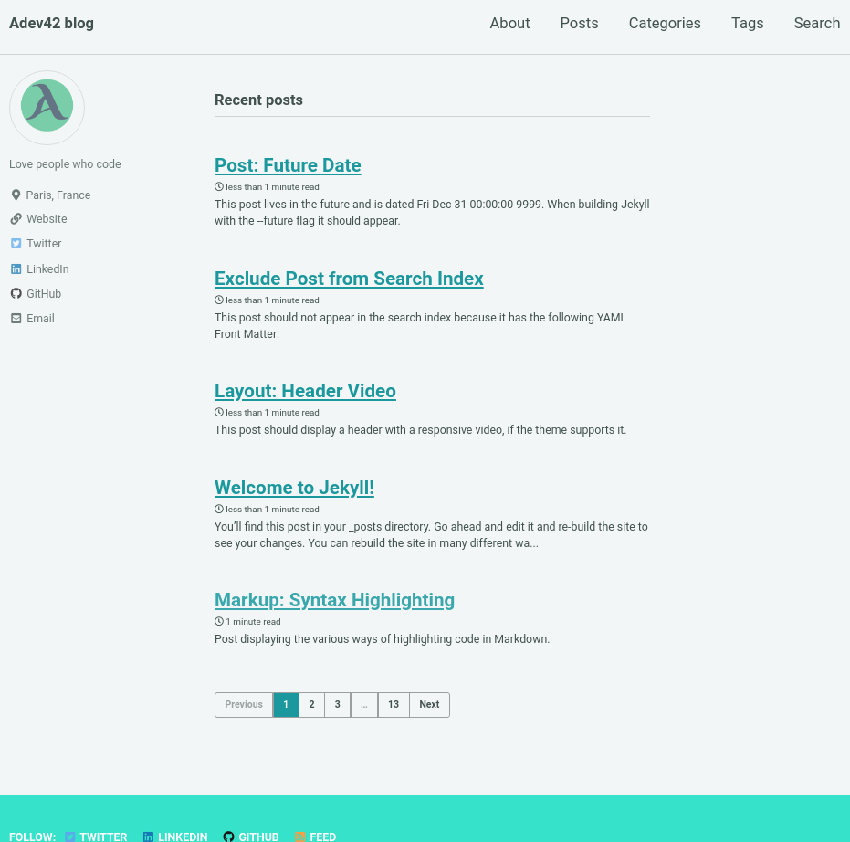

# Demo Jekyll with mmistakes theme

This is a demo static site generator using Jekyll and mmistakes theme.

Demo online at [https://tienduy-nguyen.github.io/demo-jekyll-mmistakes/](https://tienduy-nguyen.github.io/demo-jekyll-mmistakes/)

My Medium post: [https://medium.com/@tienduy/build-your-personal-website-without-spending-any-money-30e6b2264e08](https://medium.com/@tienduy/build-your-personal-website-without-spending-any-money-30e6b2264e08)

My blog post: [https://blog.adev42.com/build-your-personal-website-without-spending-any-money-using-jekyll-and-github-pages](https://blog.adev42.com/build-your-personal-website-without-spending-any-money-using-jekyll-and-github-pages)

## How to use

- Clone this repo with `git clone`
- Go to the repo directory: `cd demo-jekyll-mmistakes`
- Install the gem dependencies with `bundle install`
- Run server `bundle exec jekyll server`

## Reference

- Jekyll website: [jekyllrb.com](https://jekyllrb.com/)
- Minimal mistakes theme [source mmistakes jekyll](https://github.com/mmistakes)
- Minimal mistakes guide [minimal-mistakes guide](https://mmistakes.github.io/minimal-mistakes/docs/quick-start-guide/)

Demo home page:

